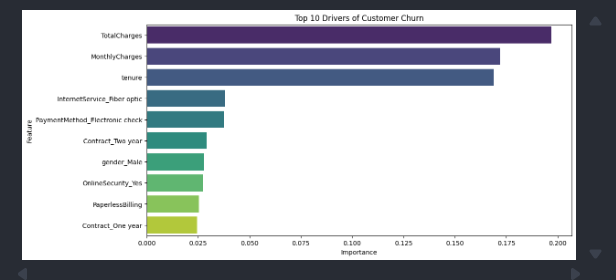

# 🔮 Customer Churn Prediction (Machine Learning Project)

<p align="center">
  
</p>

## 🔍 Problem Statement
Customer churn is a major challenge for subscription-based businesses.  
The goal of this project is to **predict which customers are likely to churn** and identify the key factors driving churn, enabling proactive retention strategies.

---

## 📌 Project Overview
This project uses **Machine Learning (Random Forest Classifier)** to predict customer churn based on behavioral and demographic data.

The workflow includes:
- Data cleaning & preprocessing  
- Feature engineering & encoding  
- Model training & evaluation  
- Feature importance analysis  
- Real-world churn prediction function  

---

## 📊 Dataset
This project uses the **Telco Customer Churn Dataset**, a widely used dataset for classification and churn analysis.

🔗 [Add Dataset Link Here]

The dataset includes:
- Customer demographics  
- Account information  
- Services subscribed  
- Billing details  
- Churn status (target variable)  

---

## 🚀 Key Insights
- 📉 Customers with **high monthly charges + low tenure** are more likely to churn  
- 💳 **Electronic check payments** show higher churn rates  
- 🌐 **Fiber optic users** tend to churn more than other service types  
- 📆 **Long-term contracts (1–2 years)** significantly reduce churn  

---

## 🛠️ Tech Stack
- **Language:** Python  
- **Libraries:** Pandas, Scikit-learn, Seaborn, Matplotlib  
- **Model:** Random Forest Classifier  

---

## ⚙️ Machine Learning Workflow

👉 [View Python Script](./churn_prediction.py)

### 1. Data Cleaning
- Converted `TotalCharges` to numeric  
- Handled missing values  
- Removed unnecessary columns (e.g., customerID)  

### 2. Feature Engineering
- Label encoding for binary columns  
- One-hot encoding for categorical variables  
- Final dataset transformed into ML-ready format  

### 3. Model Training
- Train-test split (80/20)  
- Random Forest Classifier used  
- Model trained on structured features  

### 4. Model Evaluation
- Confusion Matrix  
- Classification Report (Precision, Recall, F1-score)  

### 5. Feature Importance
Top drivers of churn identified:
- Total Charges  
- Monthly Charges  
- Tenure  
- Contract Type  
- Internet Service  

---

## 🔮 Prediction System
A custom function is implemented to predict churn for new customers:

```python
predict_churn(customer_data)
